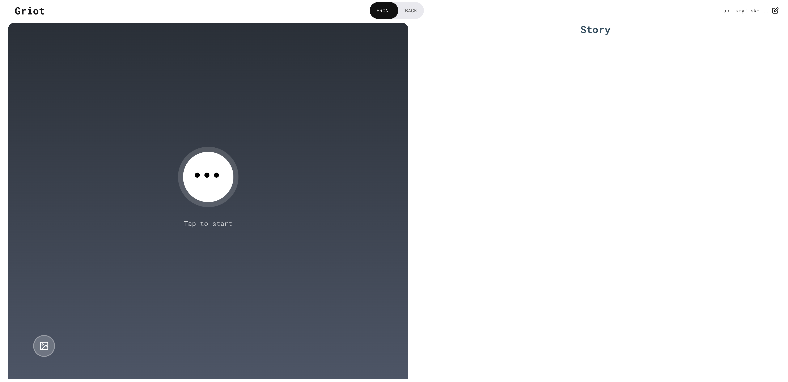

# Griot Voice Playground

Griot Voice Playground is an interactive storytelling application that uses OpenAI's real-time voice API to help users create meaningful stories from their images. Like the traditional West African Griot storytellers, this AI assistant guides users through a conversational journey to uncover and craft compelling narratives.



## Features

- Real-time voice conversation with an AI storytelling assistant
- Image-based story generation
- Guided storytelling through interactive questions
- Emotion and memory extraction from personal moments
- Story editing and refinement
- Social sharing capabilities

## Getting Started

### Prerequisites

- Node.js installed on your system
- An OpenAI API key with access to the real-time API features

### Installation

1. Clone this repository
2. Install dependencies:

```shell
npm install
```

3. Start the application:

```shell
npm start
```

The application will be available at `localhost:3000`.

## Using the Application

1. **API Key Setup**
   - On first launch, you'll need to enter your OpenAI API key
   - ⚠️ **Important**: Be mindful of API usage as real-time conversations can be costly
   - We recommend keeping conversations concise and focused

2. **Starting a Story Session**
   - Click "Connect" to start a new session
   - Grant microphone access when prompted
   - Choose between manual (Push-to-talk) or VAD (Voice Activity Detection) modes

3. **Creating Your Story**
   - Upload an image you'd like to tell a story about
   - The Griot assistant will guide you through questions about the image
   - Share your thoughts and feelings about the moment
   - Review and edit the generated story
   - Share your story with friends

## Important Notes

- Keep conversations focused to manage API costs
- You can interrupt the assistant at any time during the conversation
- Your API key is stored locally and can be updated through the UI
- Voice conversations require microphone access

## Privacy and Data

- Images and stories are processed securely
- Your OpenAI API key is stored locally in your browser
- No data is permanently stored without your consent

## Acknowledgements

This project uses:
- OpenAI's real-time voice API
- React for the frontend interface
- Web Audio API for voice processing

## Support and Contact

If you encounter any issues or have questions, please:
1. Create an issue in this repository
2. Contact our support team at [your-support-email]

## License

private repo
